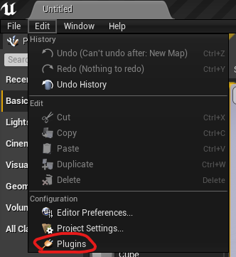
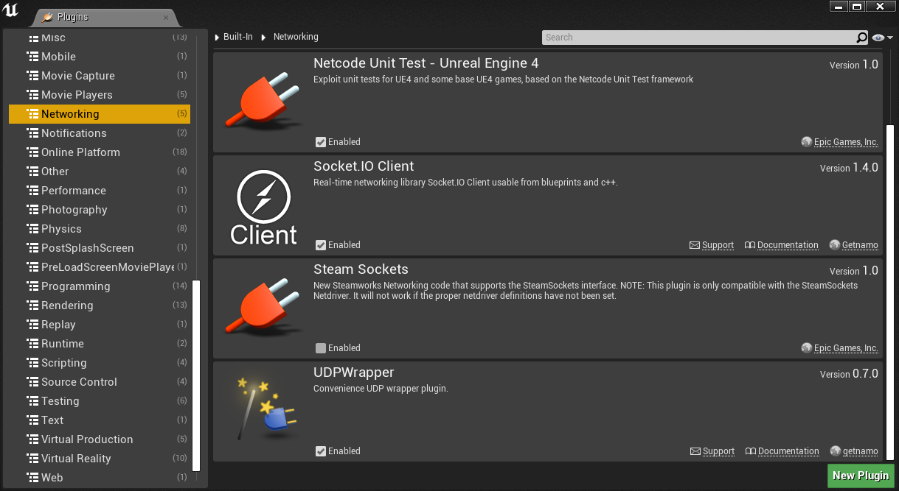
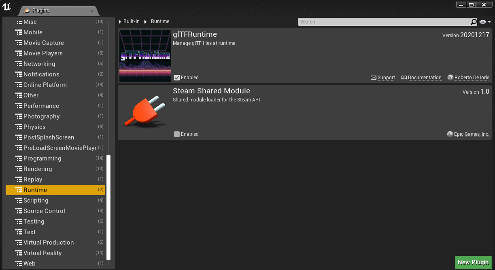
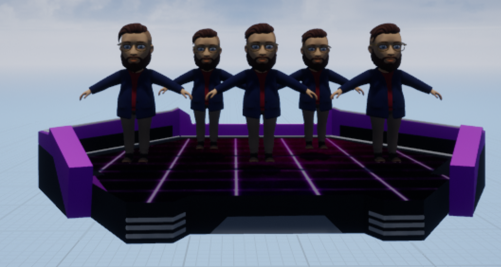
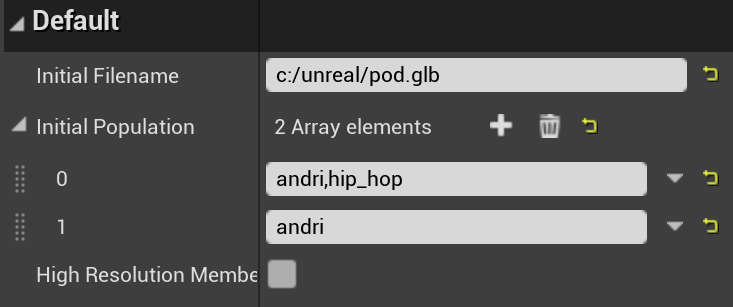
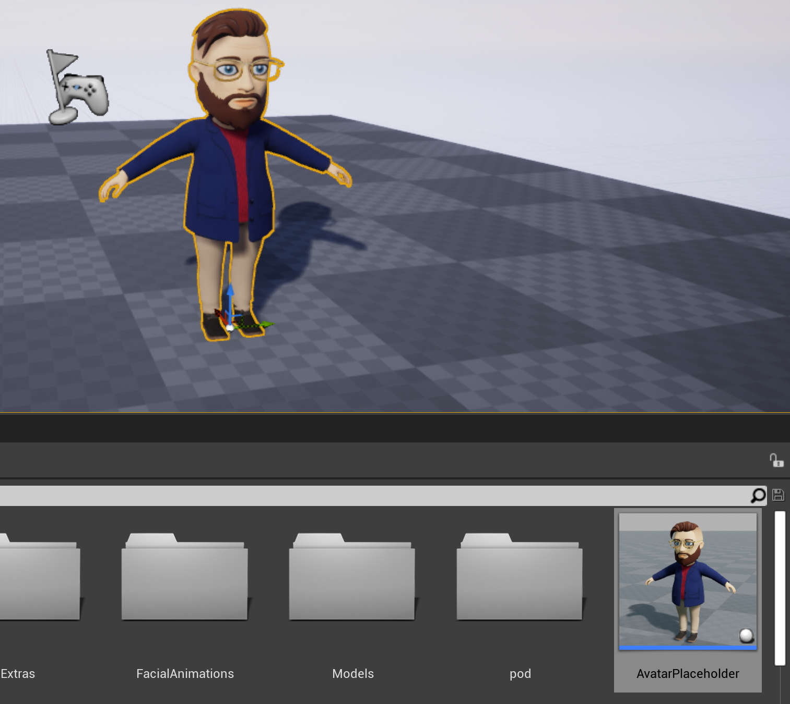
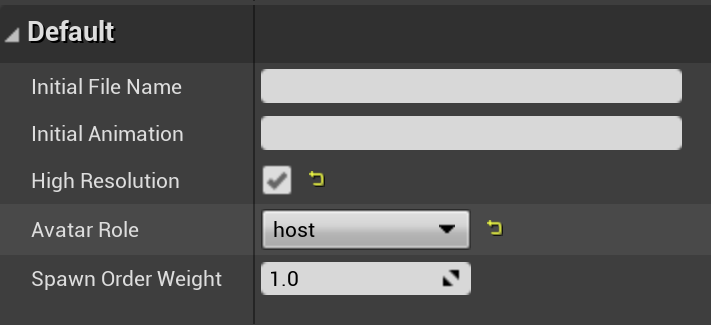
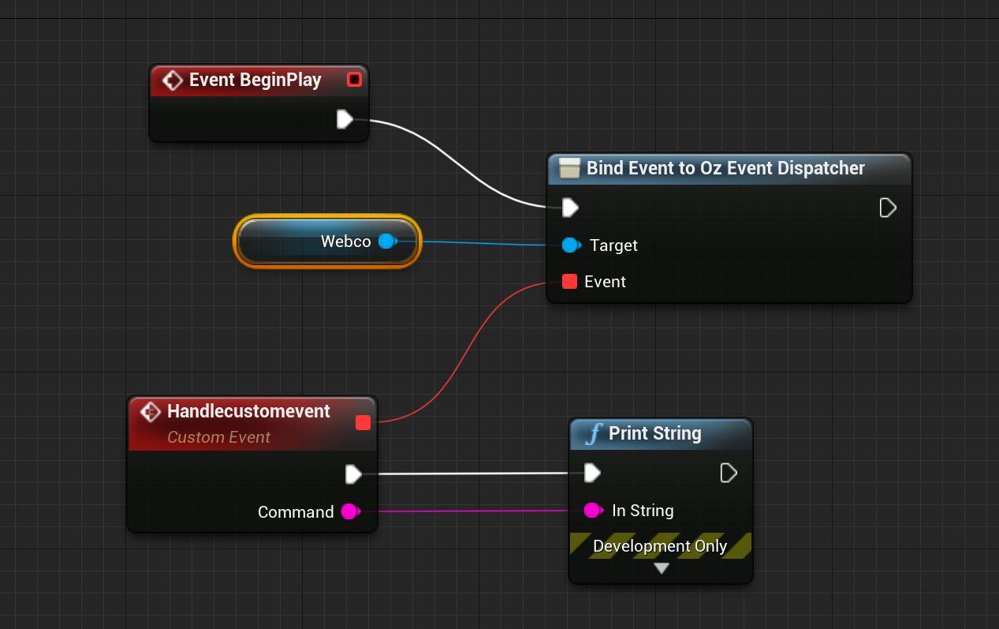
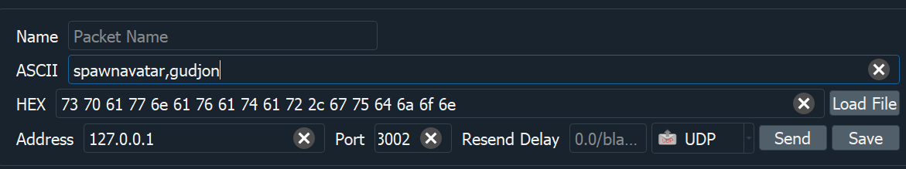

#  Boost


OZ Boost is an Unreal Engine 4 Plugin to create a unique Pod experience. 

##  1. <a name='Content'></a>Content
<!-- vscode-markdown-toc -->
* 1. [Content](#Content)
* 2. [Dependencies](#Dependencies)
* 3. [Installation](#Installation)
	* 3.1. [Dependencies](#Dependencies-1)
	* 3.2. [OZ-Boost](#OZ-Boost)
	* 3.3. [Adding models](#Addingmodels)
* 4. [Example](#Example)
* 5. [Feature Overview](#FeatureOverview)
	* 5.1. [PodWithAvatars](#PodWithAvatars)
	* 5.2. [AvatarPlaceholder](#AvatarPlaceholder)
* 6. [Web Controller](#WebController)
	* 6.1. [Handling custom events via web controller](#Handlingcustomeventsviawebcontroller)
	* 6.2. [Interacting via the Web Controller](#InteractingviatheWebController)
		* 6.2.1. [Commands](#Commands)
* 7. [List of animations](#Listofanimations)
* 8. [Known limitations](#Knownlimitations)
* 9. [Important Additional Information](#ImportantAdditionalInformation)

<!-- vscode-markdown-toc-config
	numbering=true
	autoSave=true
	/vscode-markdown-toc-config -->
<!-- /vscode-markdown-toc -->

##  2. <a name='Dependencies'></a>Dependencies
OZ Boost depends on few Unreal Engine plugins:

-------------------
|name|tested version|
|--|--|
|Unreal Engine|v4.26
|[glTFRuntime](https://github.com/rdeioris/glTFRuntime)|
|[udp-ue4](https://github.com/getnamo/udp-ue4)|v1.0.0|
|[socketio-client-ue4](https://github.com/getnamo/socketio-client-ue4)|v1.5.5


##  3. <a name='Installation'></a>Installation

###  3.1. <a name='Dependencies-1'></a>Dependencies

* Copy the specified dependencies into the Plugins directory of your project, along with the OZFusion plugin.
* Open your project. In some cases, an error saying that one of the plugins was built with a different version of the editor might appear. If this is the case, refer to [Important Additional Information](#important-additional-information)
* In the top left corner, go into ``Edit > Plugins``. 

<figure>

</figure>

* Navigate to ``Networking`` and make sure ```Socket.IO Client``` and ```UDPWrapper``` are enabled.

<figure>

</figure>

* Then navigate to ```Runtime``` and make sure ```glTFRuntime``` is enabled. 

<figure>

</figure>
  
* The editor will now ask you to restart the engine. Do so.

###  3.2. <a name='OZ-Boost'></a>OZ-Boost

* In the ```Content Browser```, select ```View Options > Show Plugin Content```. Then, in the top left corner of the content browser, select the little menu icon. Now you should see a folder called OZFusion Content.

###  3.3. <a name='Addingmodels'></a>Adding models

* All models are stored in ```Content/Models```. Any additional models can be placed there. Make sure to include both the ```_lod0.glb``` and ```_lod3.glb``` versions.

* Files must be copied to the correct directory using Windows Explorer, not imported via the Unreal Editor


##  4. <a name='Example'></a>Example

Checkout out the Example folder

##  5. <a name='FeatureOverview'></a>Feature Overview

The plugin features two types of placeholder objects, ```PodWithAvatars``` which is a placeholder for a pod with space for up to 5 avatars, and ```AvatarPlaceholder``` which is a placeholder for an avatar that does not belong to a pod.

There is also a communications controller that is required for live control of the scene when it is streaming to the OZ Pods app, ```BP_AvatarWebController```.

###  5.1. <a name='PodWithAvatars'></a>PodWithAvatars


<figure>

</figure>

To load a pod into the scene, simply drag the PodWithAvatars object from the content browser into the level. A few configurations can be made from the Details browser:

<figure>

</figure>


* **Initial filename** specifies the full path to a glTF file to be loaded as the pod model when the scene starts up, this is only necessary if the pod model is not being loaded by the Web Controller.
 
* **Initial population** specifies a list of avatar files to be loaded when the scene starts up, the name of an animation sequence may be included with a comma separating the name of the model from the name of the animation.

* **High resolution members** specifies that the models loaded into this pod should be the high resolution variant. The high resolution variant is saved with a file name suffix _lod0.glb, otherwise the file name is suffixed by _lod3.glb

> **Note:** The higher resolution models choose randomly from a list of six facial animations, while the lower resolution models don’t include facial animations.

The pod placeholder exposes a number of functions that can be called from the Web Controller or from a blueprint or via the sequencer.

* **Spawn pod** accepts a full path file name argument and loads a pod from file.

* **Destroy pod** removes a previously spawned pod from the scene.

* **Spawn pod member** loads an avatar into the pod and takes three arguments:
  * *  File name of avatar model, without lod suffix
  * * Slot (position where 0 is the leftmost and 4 is the rightmost)
  * * Animation *(optional)*
  
* **Destroy pod member** removes an avatar from the pod, with an argument specifying the position.

* **Animate pod member** sets the animation of the pod member in a specified position.


###  5.2. <a name='AvatarPlaceholder'></a>AvatarPlaceholder


<figure>

</figure>

To load an avatar into the scene that is not a member of a pod, drag AvatarPlaceholder from the content browser into the map.

To specify a model and animation use the options presented in the details browser:


<figure>

</figure>


The avatar placeholder also exposes functions that can be called from blueprints or sequences:

* Spawn avatar
* Destroy avatar
* Animate

##  6. <a name='WebController'></a>Web Controller

###  6.1. <a name='Handlingcustomeventsviawebcontroller'></a>Handling custom events via web controller

<figure>

</figure>

The web controller allows the creation of of custom events through an event dispatcher. To use this, instantiate the web controller in the level, and in the level blueprint create an event dispatcher connected to the web controller.


###  6.2. <a name='InteractingviatheWebController'></a>Interacting via the Web Controller
If a Web Controller actor is placed into the scene, the scene can be manipulated via the network.

This process will be handled automatically on the computer running the live scene via the kafka-unreal-gateway, but if you want to try spawning a pod or pod member by yourself, you can download a program called [Packet Sender](https://packetsender.com/download#show). 
The Web Controller takes commands in the form of a string sent via UDP, with commas separating the command and each of the arguments it accepts.

Then, while the program is running press ``Send`` with the configurations shown in the image:

<figure>

</figure>

-------------------
|||
|--|--|
|**Address**|127.0.0.1|
|**Port**|3002|
|**UDP**| |

Don’t worry about the ``HEX`` field as that is filled in automatically.

The ASCII field contains the actual command, which in this case is ```spawnavatar,gudjon``` - where ```spawnavatar``` represents the type of command and ``gudjon`` is the ID of the avatar that is to be spawned and is the same as when using the ``Filename`` field for ``Avatar``, and so to spawn a different avatar, change the ID to another one. Of course, the file still needs to exist within ``Plugins/OZFusion/Contents/Models/``.

While there are still empty ``AvatarPlaceholder`` capsules within the scene that do not belong to a pod, pressing ``Send`` will fill up the next available capsule. The capsules are filled in the order they were placed within the scene. If no empty capsules remain within the scene, pressing Send simply yields no result.

Furthermore, if you want to control the animations of the spawned ``Web_Avatars``, the following command can be set in the ``ASCII``field with the same settings as in the previous step: ``animation,andri,snake``  - Where ``animation`` represents the type of command, ``andri`` represents the ``ID`` of the ``WebAvatar`` that is supposed to change the animation, and ``snake`` is the ID of one of the available animations to play. 

####  6.2.1. <a name='Commands'></a>Commands
The Web Controller accepts the following commands

##### spawnavatar
Spawns an avatar in place of an AvatarPlaceholder object in the level, which is not a member of a pod.

*Arguments*

Requires 1 argument, 1 optional argument.

> 1. **Avatar ID**.
> 2. **Animation identifier** Check [list](#list-of-animations) for valid input. *(optional)*

##### animation
Runs an animation from the list of valid animations against a pod member.

*Arguments*

Requires 3 arguments.

> 1. **Pod index in the scene**. where 0 is the first pod.
> 2. **Location of pod member within pod** with 0 being the first on the left and 4 being the furthest to the right.  
> 3. **Animation identifier**. refer to the list later in this chapter of supported animations. Check [list](#list-of-animations) for valid input.

##### spawnpod
Loads a pod model from a glTF file.

*Arguments*

Requires 2 arguments.

> 1. **Pod index in the scene** where 0 is the first pod.
> 2. **Full path file name for pod model**. Path includes the glb file extension. 

##### destroypod

Removes a pod from the scene, leaving its slot ready to load another one.

*Arguments*

Requires 1 argument.

> 1. **Index in the scene** from 0 and up.

##### spawnpodmember

Loads an avatar from a glTF file into a pod.

*Arguments*

Requires 3 arguments, has 1 optional argument.

> 1. **Pod index**, where pod 0 is the first pod.
> 2. **Location of the pod member** within the pod, with 0 being the first on the left and 4 being the furthest to the right.
> 3. **Avatar identifier**.
> 4. **Initial animation** *(optional)* Check [list](#list-of-animations) for valid input.

##### destroypodmember

Removes a previously spawned avatar from a pod, leaving the slot open for a new member.

*Arguments*

Requires 2 arguments

> 1. **Pod index in the scene** where pod 0 is the first pod.
> 2.  **Location of the pod member** within the pod, with 0 being the first on the left and 4 being the furthest to the right.

##### custom

Passes a freeform event to the scene, which can be picked up from the Web Controller using an event dispatcher. 

Refer to the previous chapter for information the blueprint implementation.

*Arguments*

Requires 1 argument which is passed to the event handler.

##  7. <a name='Listofanimations'></a>List of animations
The following is a complete list of the IDs of currently available animations: 

* hip_hop
* super_excited
* maraschino
* cheer
* noodle
* quake
* arm_wave
* robot
* snake
* floating_in_air
* floating_in_water
* teetering
* head_bang
* super_excited_two
* cheer_two
* kick_step
* running_man
* samba
* shuffle
* raise_the_roof
* side_to_side
* idle

##  8. <a name='Knownlimitations'></a>Known limitations

* There seems to be incompatibility with some plugins, like the Megascan. As it now causes errors on compiling C++ plugin with the Megascan feature enabled.

* Make sure you have the .Net ‘Developer’ version installed on the latest Visual Studio. .

##  9. <a name='ImportantAdditionalInformation'></a>Important Additional Information

In case you received an error saying that one of the plugins was built with a different version of the editor, refer to the following instructions:
>
> * Create a new blank project with C++ instead of Blueprints. Close the project. In the > project’s folder, create a folder called Plugins. 
>
> * Paste the plugin mentioned in the error message into this folder. Go back to the project folder itself and reopen the project. You will now receive a message saying that the plugin was built with a different version asking if you’d like to rebuild it. Select yes.
>
> * When this process has finished, close this project. Now, copy the plugin itself and paste it back into Engine/Plugins/Runtime. You can now delete the new project, re-open your project and continue according to the instructions above.
>
> * Need to enable Show Engine Content, to see the OZ Plugiin.


